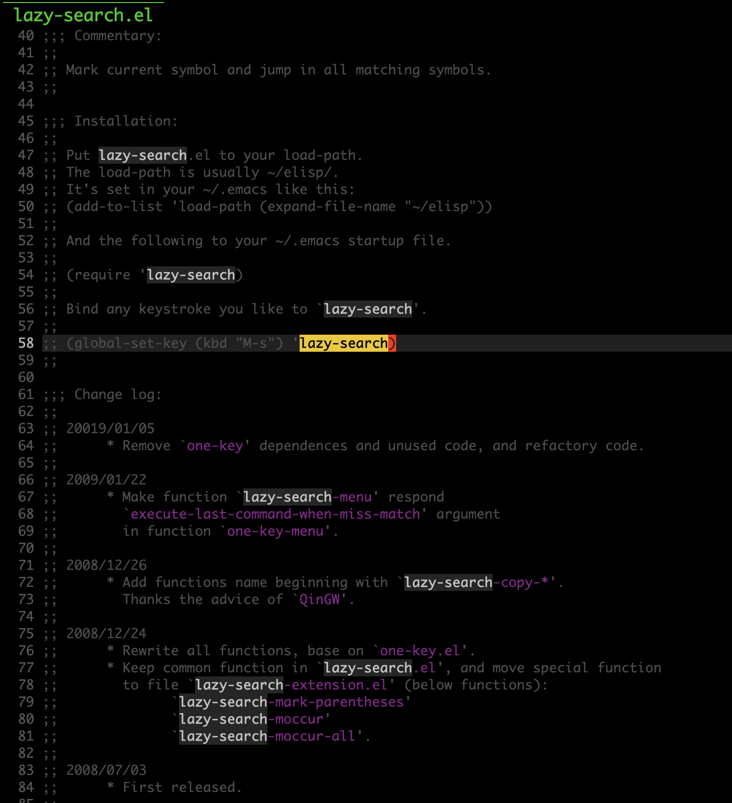

# What is lazy-search?
Mark current symbol and jump in all matching symbols.

## Installation
Clone or download this repository (path of the folder is the `<path-to-lazy-search>` used below).

In your `~/.emacs`, add the following two lines:
```Elisp
(add-to-list 'load-path "<path-to-lazy-search>") ; add lazy-search to your load-path

(require 'lazy-search)
(global-set-key (kbd "M-s") 'lazy-search)
```

## Usage
When press M-s active lazy-search, it will mark current symbol or region.
You can press below keys to jump in all matching symbols, or press q to quit lazy-search mode.

| Key       | Command                            | Description                           |
| :-------- | :----                              | :----                                 |
| s         | lazy-search-jump-to-next-match     | Jump to next match                    |
| r         | lazy-search-jump-to-previous-match | Jump to previous match                |
| .         | lazy-search-jump-to-first-match    | Jump to first match                   |
| ,         | lazy-search-jump-to-last-match     | Jump to last match                    |
| i         | lazy-search-jump-to-init           | Jump to init position                 |
|           |                                    |                                       |
| j         | lazy-search-view-next-line         | Move to next line                     |
| k         | lazy-search-view-previous-line     | Move to previous line                 |
| h         | lazy-search-view-backward-char     | Move to previous char                 |
| l         | lazy-search-view-forward-char      | Move to next char                     |
| H         | lazy-search-view-line-beginning    | Move to line beginning                |
| L         | lazy-search-view-line-end          | Move to line end                      |
|           |                                    |                                       |
| J         | lazy-search-scroll-up-one-line     | Scroll line up                        |
| K         | lazy-search-scroll-down-one-line   | Scroll line down                      |
| e         | lazy-search-scroll-down-one-page   | Scroll page up                        |
| Space     | lazy-search-scroll-up-one-page     | Scroll page down                      |
|           |                                    |                                       |
| S         | lazy-search-mark-symbol-or-region  | Mark current symbol or region         |
|           |                                    |                                       |
| w         | lazy-search-copy-object            | Copy search object to yank            |
| E         | lazy-search-edit-object            | Edit search object                    |
|           |                                    |                                       |
| c         | lazy-search-search-previous-cache  | Re-search for previous search results |
| Y         | lazy-search-search-yank            | Search yank content                   |
|           |                                    |                                       |
| t         | lazy-search-to-isearch             | Toggle to isearch mode                |
| g         | lazy-search-to-color-rg            | Search by color-rg.el                 |
|           |                                    |                                       |
| q         | lazy-search-quit                   | Quit lazy search mode                 |
